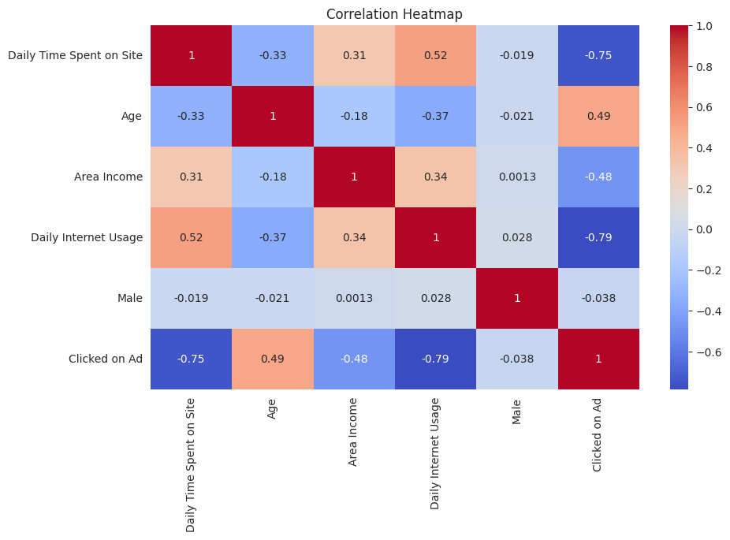
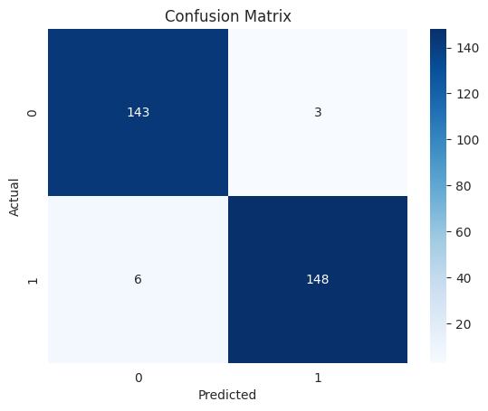
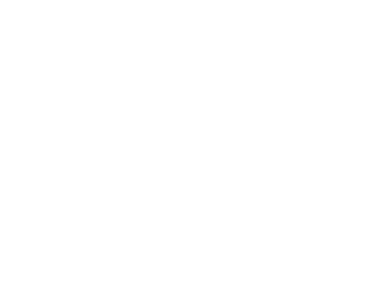
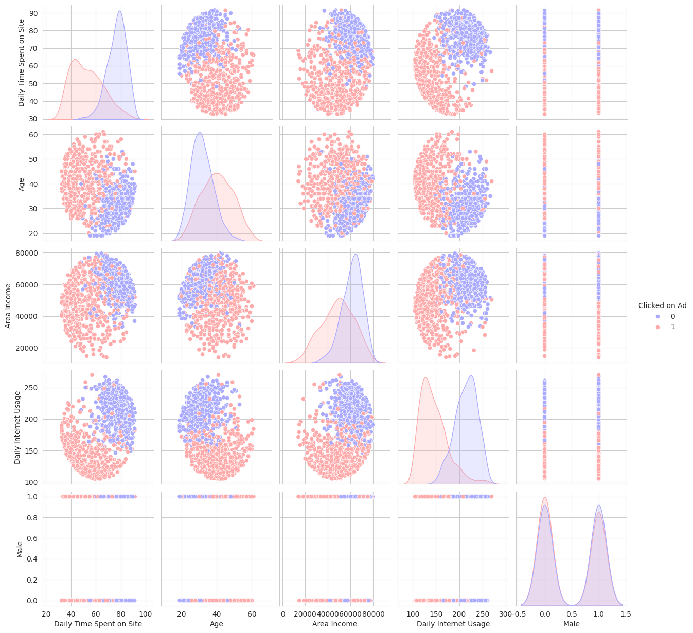

# 📊 User Behavior Analysis for Ad Click Prediction

> **A Binary Classification Pipeline built with Scikit-Learn**

---

##  Project Overview

This project develops a predictive pipeline to determine the probability of a user clicking an advertisement based on demographic profiles and browsing behavior. Beyond simple prediction, the goal was to identify the **key drivers of engagement** to optimize digital marketing ROI.

---

##  Technical Architecture & Workflow

### 1. Exploratory Data Analysis (EDA)

* **Feature Correlation:** Identified relationships between features using correlation heatmaps
* **Data Integrity:** Checked for missing values and anomalies
* **Visualization:** Used Seaborn to analyze user behavior patterns

###  Correlation Heatmap



---

### 2. Feature Engineering & Preprocessing

To ensure model stability and convergence:

* **Scaling:** Applied `StandardScaler` to normalize numerical features
* **Data Preparation:** Converted data into a suitable format for modeling
* **Feature Selection:** Evaluated relevance of available features

---

### 3. Modeling: Logistic Regression

#### Why Logistic Regression?

* **Interpretability:** Enables understanding of feature impact
* **Efficiency:** Performs well on linearly separable data
* **Baseline Model:** Establishes a strong benchmark before complex models

---

##  Performance Evaluation

The model was evaluated using a 70/30 train-test split to ensure generalization.

| Metric       | Score     |
| :----------- | :-------- |
| **Accuracy** | **97.0%** |

---

###  Confusion Matrix



---

###  ROC Curve



---

##  Additional Data Insights

### 🔹 Pairplot Analysis



This visualization highlights the separation between classes and relationships between features.

---

##  Installation & Reproducibility

```bash
git clone https://github.com/yourusername/ad-click-prediction.git
cd ad-click-prediction
pip install -r requirements.txt
```

---

##  Key Engineering Insights

* **Simplicity Works:** A well-preprocessed dataset can achieve high accuracy with a simple model
* **Behavioral Features Matter:** Time spent and usage patterns are strong predictors of user actions
* **Visualization is Critical:** EDA helped uncover patterns that guided modeling decisions

---

##  Repository Structure

```text
ad-click-prediction/
│
├── notebook/
│   └── ad_click_model.ipynb
│
├── images/
│   ├── heatmap.png
│   ├── confusion_matrix.png
│   ├── roc_curve.png
│   └── pairplot.png
│
├── requirements.txt
├── README.md
```

---

## 👩 Author

Tanu Sharma
